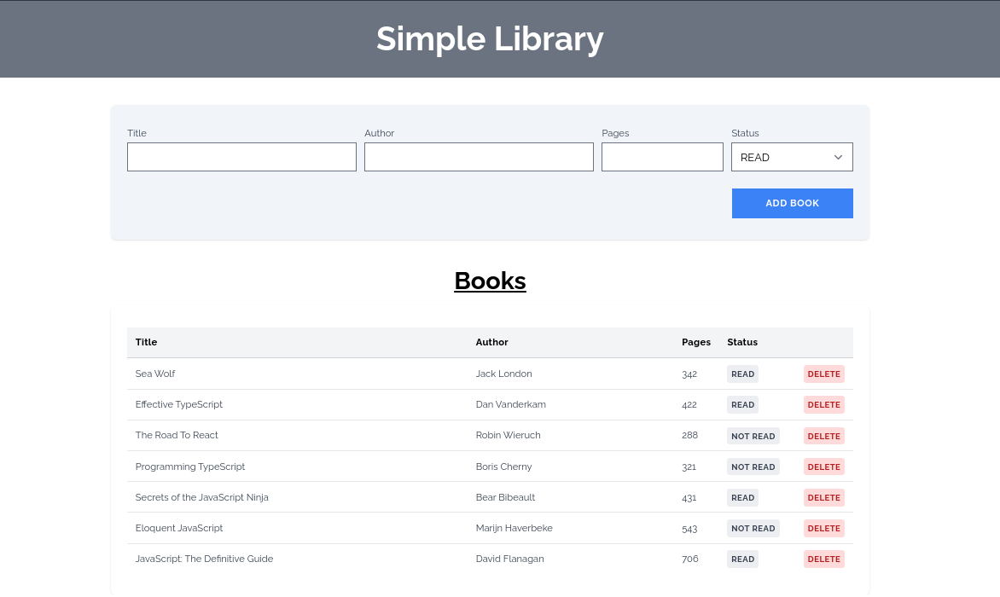
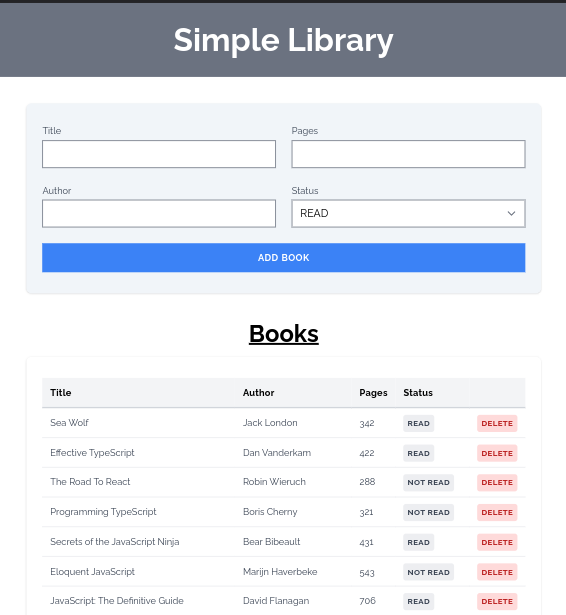
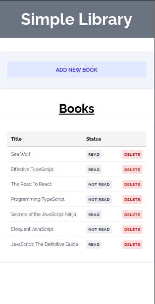

# Library

ဒီ project ဟာ [The Odin Project](https://www.theodinproject.com "The Odin Project: Your Career in Web Development Starts Here") ရဲ့ [Fullstack Javascript](https://www.theodinproject.com/paths/full-stack-javascript) သင်ရိုးထဲက ပါတာဖြစ်ပါတယ်။ JavaScript Object constructor တွေအကြောင်းကို ပိုနားလည်ပြီး သုံးတတ်စေဖို့ ရည်ရွယ်ပါတယ်။

ကျနော် ဒီ project ကို စလိုက်တာက မြန်မြန်လုပ်ဖြစ်အောင်လို့ပဲ။ မဟုတ်ရင် အချိန်ဆွဲတတ်လို့။ တစ်ရက်နှစ်ရက်အတွင်း ပြီးချင်လည်းပြီးမယ်။ တစ်ပတ်လောက်ကြာရင်လဲ ကြာမယ်ပေါ့ဗျာ။ အရေးကြီးတာက လုပ်ဖြစ်လိုက်ဖို့ပါပဲ။ စကားများနေတာတော်ပါပြီ။ စလိုက်တော့မယ်။

## လုပ်ဆောင်ချက်များ

- စာအုပ်စာရင်းမှတ်ထားတဲ့ ပုံစံမျိုးပါ။
  - စာအုပ်ခေါင်းစဥ်၊
  - စာရေးဆရာ၊
  - ခန့်မှန်းစာမျက်နှာ၊
  - ဖတ်ပြီးသား ဟုတ်-မဟုတ်၊ စတာတွေကို table နဲ့ ပြပေးမယ်။
- စာအုပ်အကြောင်း ဖြည့်ဖို့ form တစ်ခု ပါမယ်။ user က ရိုက်ထည့်လိုက်တဲ့ စာအုပ်က စာရင်းရဲ့ ထိပ်ဆုံးမှာ ပြမယ်။
- စာအုပ်တစ်အုပ်ချင်းစီကို ဖျက်ချင်ရင် ဖျက်ပစ်ဖို့အတွက် button တစ်ခုပါမယ်။
- စာအုပ်ထည့်တုန်းက မဖတ်ရသေးပေမယ့် တစ်ချိန်မှာပြန်ကြည့်လို့ ဖတ်ပြီးသားဆိုရင် ဖတ်ပြီးလို့ ပြောင်းနိုင်မယ်။
- browser ရဲ့ localstorage မှာ သိမ်းပေးမယ်။

## Tech Stack

- HTML
- TailwindCss
- VanillaJS
- OOP concepts
